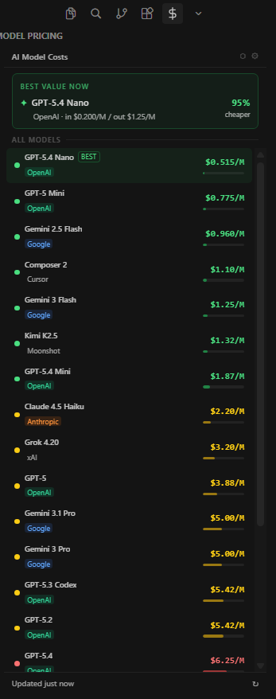

# AI Cost Overlay for Cursor

Real-time AI model pricing directly in your Cursor editor. Compare costs, find the best value, and make informed decisions about which AI model to use.

## Features

- **Real-time Pricing**: Fetches live model pricing from LiteLLM's comprehensive registry
- **Smart Recommendations**: Highlights best-value models based on price and context window
- **Cursor Integration**: Seamlessly switch models by opening the model picker and copying the model name
- **Customizable Settings**: Configure refresh intervals and display preferences
- **Offline Support**: Cached pricing data works even without internet

## Installation

1. Download the `.vsix` file from the releases page
2. In Cursor/VS Code, press `Ctrl+Shift+P` (or `Cmd+Shift+P` on Mac)
3. Type "Install from VSIX" and select the downloaded file
4. Reload the window when prompted

## Usage

Click the **dollar sign icon** in the left sidebar to open the AI Cost Overlay panel.

### Switching Models

Click any model card to:
1. Open the Cursor AI panel
2. Open the model picker dropdown
3. Copy the model name to your clipboard

Then paste the model name in the picker to select it.

### Settings

Access settings via the gear icon in the panel:

- **Refresh Interval**: How often to fetch new pricing data (12h, 24h, 48h, or 72h)
- **Auto-refresh**: Automatically update pricing on startup
- **Best Value Days**: Number of days to consider for value calculations

## Commands

| Command | Description |
|---------|-------------|
| `AI Cost Overlay: Open Panel` | Show the cost overlay panel |
| `AI Cost Overlay: Refresh Pricing` | Manually refresh model pricing |
| `AI Cost Overlay: Open Settings` | Configure extension settings |

## Data Sources

- **LiteLLM Model Registry**: https://github.com/BerriAI/litellm
- **Cursor Models**: https://cursor.com/docs/models-and-pricing

Pricing is automatically updated based on your refresh interval settings.

## Requirements

- Cursor Editor or VS Code 1.74.0+

## License

MIT License - see [LICENSE](LICENSE) file for details.
